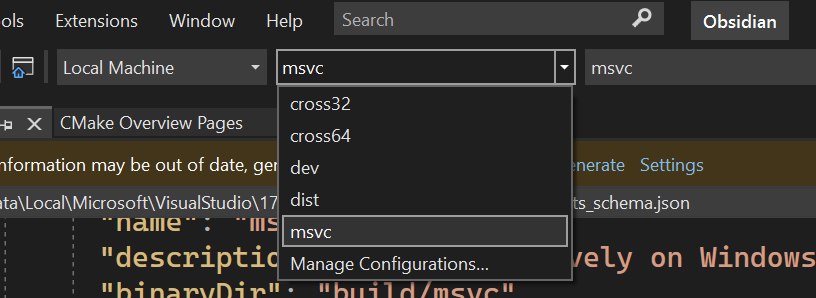

# COMPILING Obsidian

## BSD Dependencies
1. CMake Utilities:
   * package: `cmake`

2. Xorg:
   * package: `xorg` (`xorg-libraries` on its own doesn't seem sufficient)

The C++ compiler/toolchain should already be present on a typical BSD install

## Linux Dependencies (MSYS has some differences; see MSYS Cross-Compilation section below)

1. C++ compiler and associated tools
   * packages: `g++` `binutils`
   * if compiling with clang: `clang`
   * compiler and toolchain need C++17 capabilities

2. GNU make
   * package: `make`

3. CMake Utilities:
   * package: `cmake`

4. Development libraries
   * packages: `libxft-dev` `libfontconfig1-dev`

5. FLEX
   * package: `flex`

### Optional

6. Code formatting tools
   * package: `clang-tidy`
   * python package (install with pip): `cmakelang`

## Linux Compilation

Assuming all those dependencies are met, then the following steps
will build the Obsidian binary.

* Before you run any other command, please check the output of the following
command. (The '>' is just the prompt)

```
> cmake --version
```

* If you see a version that is at least 3.19.0, then follow that up with these commands:

```
> cmake --preset dist
> cmake --build --preset dist (-j# optional, with # being the number of cores you'd like to use)
```

* Otherwise, use these commands:

```
> cmake -B build -DCMAKE_BUILD_TYPE=Release
> cmake --build build (-j# optional, with # being the number of cores you'd like to use)
```

Then, Obsidian can be launched with:

```
> ./obsidian
```

## Windows Cross-Compilation on Linux using MinGW

You will need the `mingw-w64` package as well (or your distro's equivalent).

* Before you run any other command, please check the output of the following
command. (The '>' is just the prompt)

```
> cmake --version
```

* If you see a version that is at least 3.19.0, then follow that up with these commands:

```
> cmake --preset cross64 (use cross32 for a 32-bit build)
> cmake --build --preset cross64 (-j# optional, with # being the number of cores you'd like to use)
```

* Otherwise, use these commands:

```
> cmake -B build -DCMAKE_BUILD_TYPE=Release -DCMAKE_TOOLCHAIN_FILE=./Toolchain_mingw64.cmake (use Toolchain_mingw32.cmake for a 32-bit build)
> cmake --build build (-j# optional, with # being the number of cores you'd like to use)
```

Then, Obsidian can be launched (in Windows, or with Wine) with:

```
> ./obsidian.exe
```

## Windows Cross-Compilation using MSYS
You will need to install the following on top of the regular MSYS Mingw64 install:
   * package: `mingw-w64-(arch)-clang-tools-extra`
   * package: `mingw-w64-(arch)-cmake`

Similar to the above directions:

```
> cmake -B build -G "MSYS Makefiles"
> cmake --build build (-j# optional, with # being the number of cores you'd like to use)
```

Then, Obsidian can be launched (in Windows) with:

```
> obsidian.exe
```

## Windows Compilation using Visual Studio

Obsidian now supports compilation on native Windows. You will need Visual
Studio 2022 installed to perform the build.

* Clone and open the repository using Visual Studio.
* Ensure the "msvc" preset is selected in the following dropdown.



* Hit "Build" (F7 by default) and wait for the magic to happen.
* DO NOT run Obsidian from within Visual Studio! It won't work properly.
  Instead, open the Obsidian folder in the file explorer and run your brand new
  `obsidian.exe`.

# INSTALLING Obsidian

This is a work-in-progress; needs to be revisited after the CMake conversion is finalized
